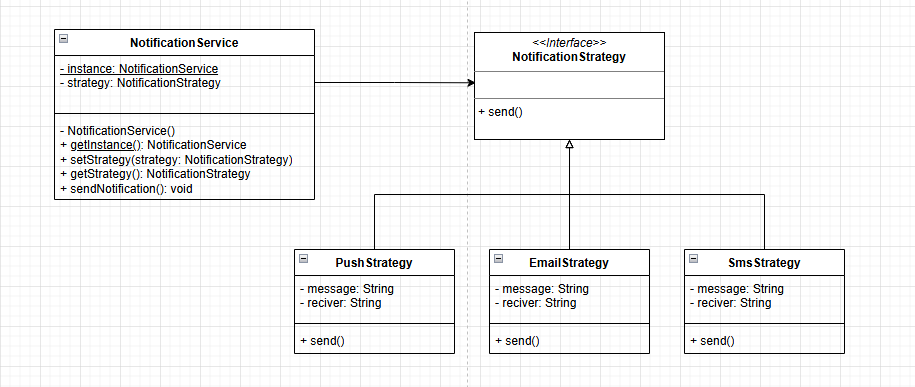
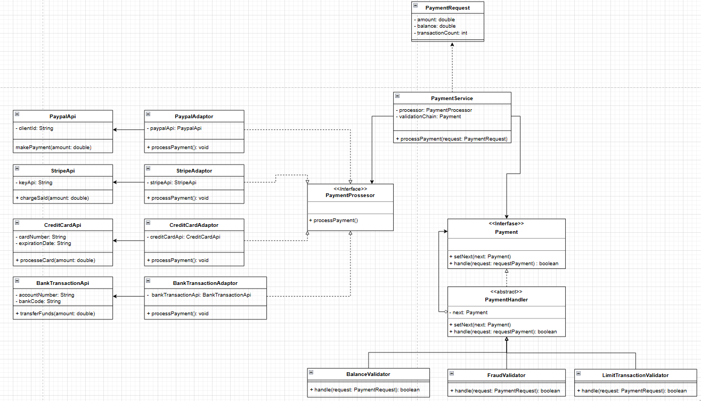

## Refuerzo

## ejercicio 1: notificaciones

## patrones utilizados

## 1 singleton

De tipo creacional, este patron se utilizo para asegurar
que el servicio de notificacion tuviera una unica instancia 
como se solicitaba en el ejercicio

## 2 Strategy

De comportamiento, Se utilizo para definir el comportamiento
de cada canal de notificacion sin necesidad de modificar el codigo
del servicio

## Diagrama de clases:

## ejercicio 2: procesamiento de pagos

## patrones utilizados

## 1 adapter

De tipo estructural este patron se uso para cumplir con el papel de traduccir las apis de cada metodo de pago
a un metodo concreto independientemente de como se manejaran dentro de su api

## 2 chain of responsability

De tipo comportamiento este patron se uso para implementar los validadores
de balance, fraude y limite de transacciones para que cada uno evalue si se continua o
el proceso o no adeams de permitir añadir mas validadores a futuro.

## Diagrama de clases:
